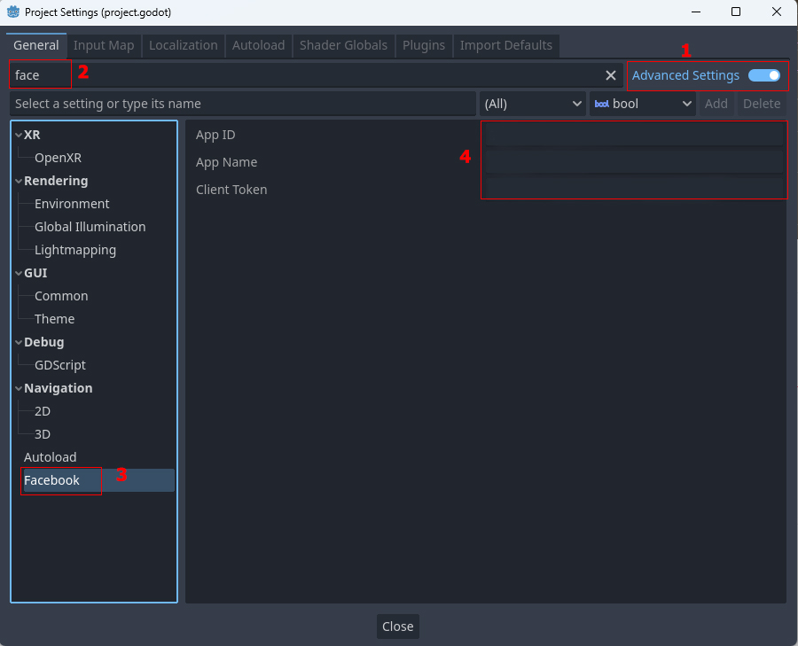
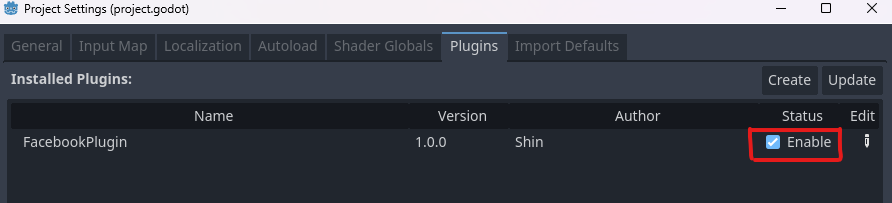
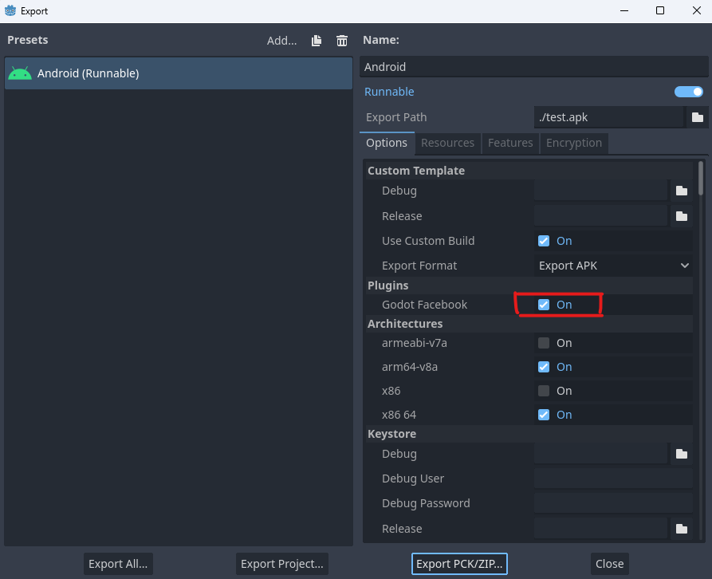
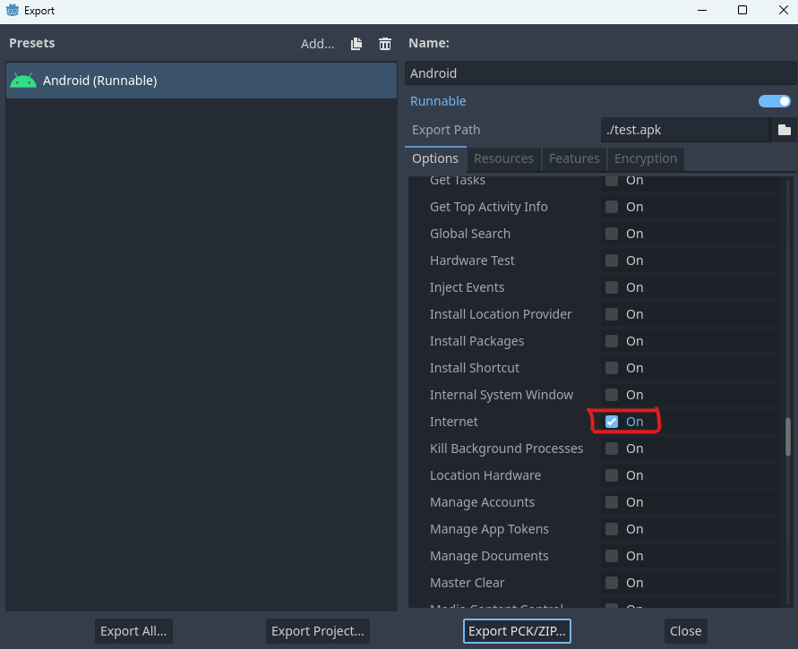
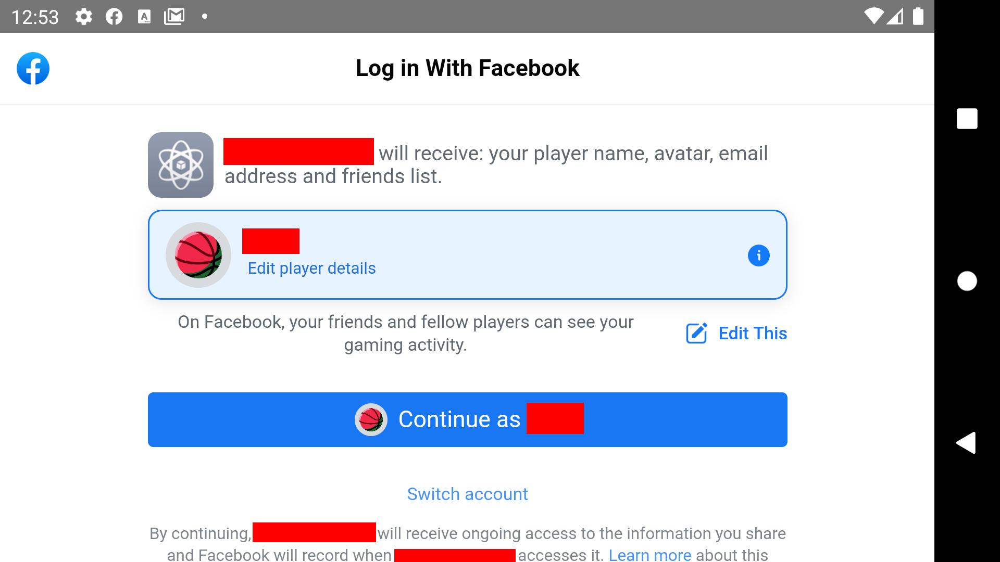

# Introduction
---
This plugin has full integrated Facebook API functionality. **Only support for Godot 4+.**
- _Android_: **Supported.**
- _iOS_: No planning yet now. Will be supported in the future.
- _Web_: Unsupported.

# Getting Started
---
1. Sign in to your Facebook developer account and [create an application page](https://developers.facebook.com/apps/create/).
For more information, see [Getting started](https://developers.facebook.com/docs/android/getting-started).

2. Install custom build for [Android](https://docs.godotengine.org/en/stable/tutorials/export/android_custom_build.html).

3. Download the latest release version [on Github](https://github.com/quocsinh/godot-plugin-facebook/releases).
   (both 2 files **facebook_addon.zip** and **facebook_plugin.zip**).

4. Extract the **facebook** folder in
   <span style="color:red">*facebook_addon.zip*</span> into
   <span style="color:red">*res://addons*</span>
and all files in
   <span style="color:red">*facebook_plugin.zip*</span> into
   <span style="color:red">*res://android/plugins*</span>

5. In Godot Editor, open **Project > Project Setting.**

   
Enable **Advanced Setting** > Typing _face_ in the **Filter Setting** field > Click the **Facebook** tab and fill all content on the right side.
_App ID_ and _Client Token_ can find it on your Facebook application page.

   **Note:** You must fill in all 3 fields. Otherwise, you will get an error.

   ```scss
   If you don't see the Facebook tab, as shown above, you need to double-check steps 3 & 4 again.
   ```

6. Switch to the _Plugins_ tab and make sure **FacebookPlugin** has been enabled.

   
7. Open **Project > Export...**
   
   
   
   Put a tick on the **Godot Facebook** and **Internet**.

8. OK, let's start testing it. Create a **Button** and attach the script below:
   <div class="code-example" markdown="1">
   ```js
   extends Button
   
   func _on_button_pressed():
       var facebook_plugin = get_node("/root/GodotFacebook")
       facebook_plugin.login_response.connect(_on_login_status)
       facebook_plugin.login(["email", "public_profile", "user_friends"])
   
   func _on_login_status(code: int, data: Dictionary):
      print(data)

   ```
   </div>

   Run your game on a real device or simulator. 
   If you see as shown below, congratulations, you have successfully integrated the Godot Facebook SDK.
   
   
   
   Usually, you won't succeed if this is your first time getting used to Facebook SDK.
   Please be patient and find more information on google. If you have any problems, feel free to create an [issue](https://github.com/quocsinh/godot-plugin-facebook/issues),
   I’d be happy to help.
